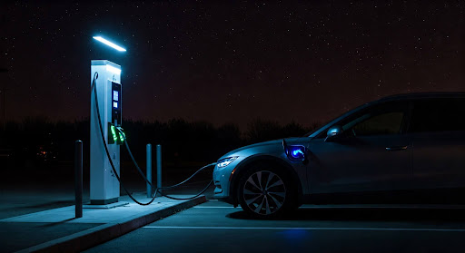
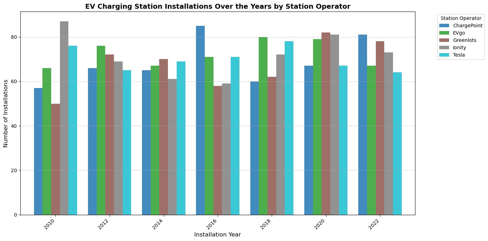

# EV Charging Station Utilization & Demand Patterns

### Team Members: 
Angelina Murdock (@Angelinamurdock), Joe Portnoy (@joeportnoy), Jennifer Kim (@JenniBean-K), Tatenda Manenji (@Tatenda93), Matthew Guy (@mattguy22)

### Project Description
The goal of this project is to analyze EV charging station data, which contains detailed information about station locations, charging capacities, availability, usage statistics, and more. We will uncover utilization and demand patterns by exploring how factors like charging capacity, availability hours, and installation year influence station usage. This analysis will provide data-driven insights to optimize EV charging infrastructure, enhance user accessibility, and improve resource allocation.

### Project Scope: 
**Objective:** Identify key drivers influencing EV charging station utilization and demand using the provided dataset.

**Focus Areas:** Charging capacity (kW), station availability (24/7 vs. limited hours), installation year, seasonal usage trends, city-wise distribution, and cost analysis.

**Outcome:** Develop actionable insights to improve station efficiency, resource planning, and infrastructure deployment strategies.

**Research Questions to Answer:** 
1. What is the trend in EV installations over the years?
2. How does charging capacity (kW) relate to station usage?
3. Do stations with 24/7 availability attract more users compared to those with limited hours?
4. Which cities have the highest and lowest average daily usage?
5. What is the cost by city (distribution)

### Datasets & API to Be Used: 
https://www.kaggle.com/datasets/vivekattri/global-ev-charging-stations-dataset

https://www.geoapify.com/geocoding-api/?gad_source=1&gclid=CjwKCAiA74G9BhAEEiwA8kNfpSEXDkNnqyZ0ZBp1kvDgb7O2labggYOAijzlVPdZhIFnfWyhGkcTXxoCnuwQAvD_BwE

### Project Submission Requirements: 
**GitHub Repository:**
Complete analysis uploaded with a professional README.

**Visualizations:**
6–8 clear, well-labeled visualizations.

**Analysis & Conclusion:**
Professional summary of findings, supported by statistical analysis.

**Group Presentation:**
All members participate, with slides that are clean and engaging.

**Slide Deck:**
Relevant, professional slides demonstrating project outcomes effectivel

### Key Findings

**EV Insights**
- Steady and Sustainable Growth: Focus on long-term expansion with a balanced approach.
- Moderate Number of Installations: Avoid oversaturation while ensuring accessibility.
- Limited Operating Hours: Optimize resource allocation and reduce costs.
- Use 50 or 150 kW Chargers: Cost-effective solution without sacrificing functionality.
- Plan for Growth Strategically:
- Expand in moderate-use cities to establish presence.
- Add more chargers in high-demand cities to maximize impact.
- Leverage Government Subsidies: Invest in cities where subsidies lower installation and operational costs.

**Additional Notes regarding the data**
- Dataset was too broad and compromised (ex. Latitude and Longitude were incorrect)
- Data evenly distributed across all questions and analysis