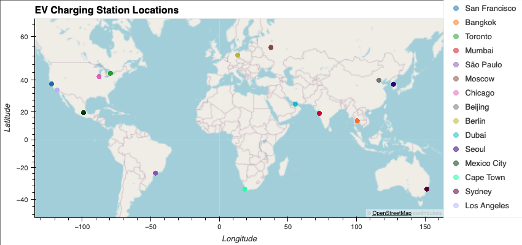
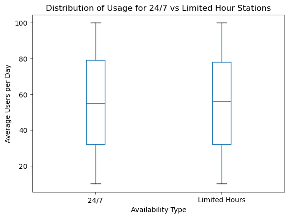
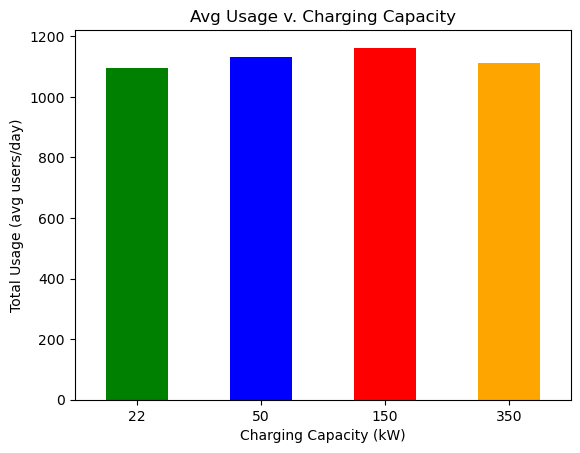

# EV Charging Station Utilization & Demand Patterns

### Team Members: 
Angelina Murdock (@Angelinamurdock), Joe Portnoy (@joeportnoy), Jennifer Kim (@JenniBean-K), Tatenda Manenji (@Tatenda93), Matthew Guy (@mattguy22)

### Project Description
The goal of this project is to analyze EV charging station data, which contains detailed information about station locations, charging capacities, availability, usage statistics, and more. We will uncover utilization and demand patterns by exploring how factors like charging capacity, availability hours, and installation year influence station usage. This analysis will provide data-driven insights to optimize EV charging infrastructure, enhance user accessibility, and improve resource allocation.

### Project Scope: 
**Objective:** Identify key drivers influencing EV charging station utilization and demand using the provided dataset.

**Focus Areas:** Charging capacity (kW), station availability (24/7 vs. limited hours), installation year, seasonal usage trends, city-wise distribution, and cost analysis.

**Outcome:** Develop actionable insights to improve station efficiency, resource planning, and infrastructure deployment strategies.

**Research Questions to Answer:** 
1. What is the trend in EV installations over the years?
2. How does charging capacity (kW) relate to station usage?
3. Do stations with 24/7 availability attract more users compared to those with limited hours?
4. Which cities have the highest and lowest average daily usage?
5. What is the cost by city (distribution)

### Datasets & API to Be Used: 
https://www.kaggle.com/datasets/vivekattri/global-ev-charging-stations-dataset

https://www.geoapify.com/geocoding-api/?gad_source=1&gclid=CjwKCAiA74G9BhAEEiwA8kNfpSEXDkNnqyZ0ZBp1kvDgb7O2labggYOAijzlVPdZhIFnfWyhGkcTXxoCnuwQAvD_BwE

### Project Submission Requirements: 
**GitHub Repository:**
Complete analysis uploaded with a professional README.

**Visualizations:**
6–8 clear, well-labeled visualizations.

**Analysis & Conclusion:**
Professional summary of findings, supported by statistical analysis.

**Group Presentation:**
All members participate, with slides that are clean and engaging.

**Slide Deck:**
Relevant, professional slides demonstrating project outcomes effectivel

### Key Findings: EV Charging Expansion Analysis

  

Our analysis highlights key factors for **cost-effective and sustainable EV charging expansion**:  

- **A moderate number of installations balances demand and cost.**  
  Deploying too many chargers too quickly can lead to underutilization and unnecessary expenses. A measured approach ensures that installations match actual demand, optimizing both financial and operational efficiency.  

- **Limited operating hours help optimize efficiency and expenses.**  
  By restricting charging availability to peak usage times, we can reduce maintenance and energy costs while still meeting the needs of most users. This approach helps maximize profitability while keeping infrastructure manageable.

- **50 or 150 kW chargers provide a lower-cost alternative while meeting user needs.**  
  High-powered chargers are expensive and may not always be necessary. Choosing 50 or 150 kW chargers offers a more affordable solution that still provides adequate charging speed for most customers, making expansion more financially viable.

- **Growth should align with usage trends—expand in moderate-use cities and scale up in high-demand areas.**  
  Instead of a one-size-fits-all expansion, data should guide growth. Moderate-use cities can benefit from an initial presence, while high-demand areas may require more chargers to accommodate increasing traffic. 

- **Government subsidies can significantly reduce costs in select cities.**  
  Many local governments offer incentives for EV infrastructure, which can offset installation and operational expenses. Prioritizing investments in these locations allows for more cost-effective deployment and long-term sustainability.

These findings provide a **data-driven foundation** for making **smart investment decisions** that maximize impact while maintaining financial efficiency.

**Opportunities for further analysis**

Future analysis should focus on gathering more comprehensive datasets on EV chargers, with a targeted approach to specific cities. This includes obtaining detailed data on the number of registered electric vehicles in each location, as well as identifying trends in EV adoption to uncover growth patterns and shifts in consumer behavior. A deeper understanding of these factors would provide clearer insights into which cities present the strongest opportunities for new EV charging station development, ensuring a more data-driven and strategic expansion.

Our analysis revealed several limitations in the dataset that present opportunities for further refinement. The dataset was overly broad and contained compromised data points, such as incorrect latitude and longitude values, which may have impacted the accuracy of location-based insights. Additionally, the data was evenly distributed across all questions and analyses, potentially masking meaningful variations or trends.